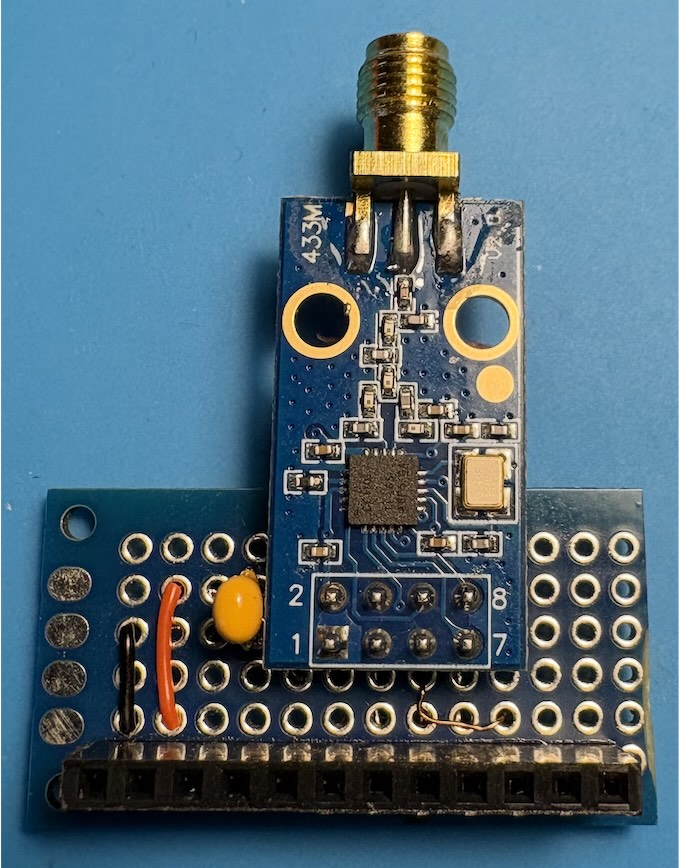

# C1101 RF module for Lilka

## Compatibility
Bruce firmware, all functions of the RF app, up to 928 MHz. Choose CC1101 in Config menu.

## Inventory
- CC1101 Transceiver module with 2x4 pins
- matching SMA antenna
- 20x80 prototype PCB
- female 12-pin header
- thin copper wires
- a ceramic capacitor 0.2-0.5uF (optional)

## Wiring
| Lilka J2 # | Lilka pin | CC1101   |
|------------|-----------|----------|
| 1          | GND       | 1 GND    |
| 2          | 3V3       | 2 VCC    |
| 3          | RX (44)   |          |
| 4          | TX (43)   |          |
| 5          | 48        | 8 GD2    |
| 6          | 47        | 4 SS     |
| 7          | 21        | 3 GD0    |
| 8          | 14        | 6 MOSI   |
| 9          | 13        | 7 MISO   |
| 10         | 12        | 5 SCK    |
| 11         | 3V3       |          |
| 12         | GND       |          |

## Assembly
The female pin header and the LoRa module are aligned to ensure a secure fit when plugged into Lilka.

